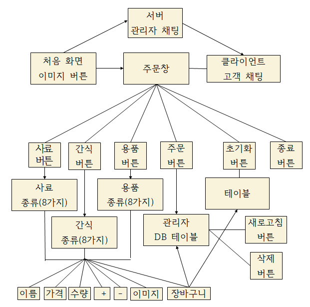
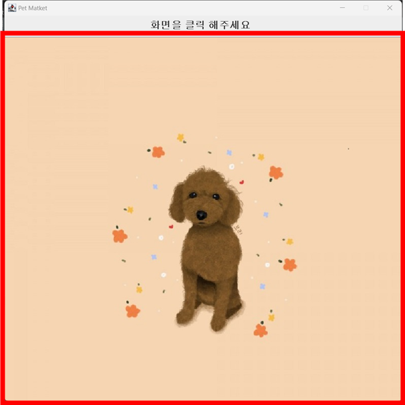
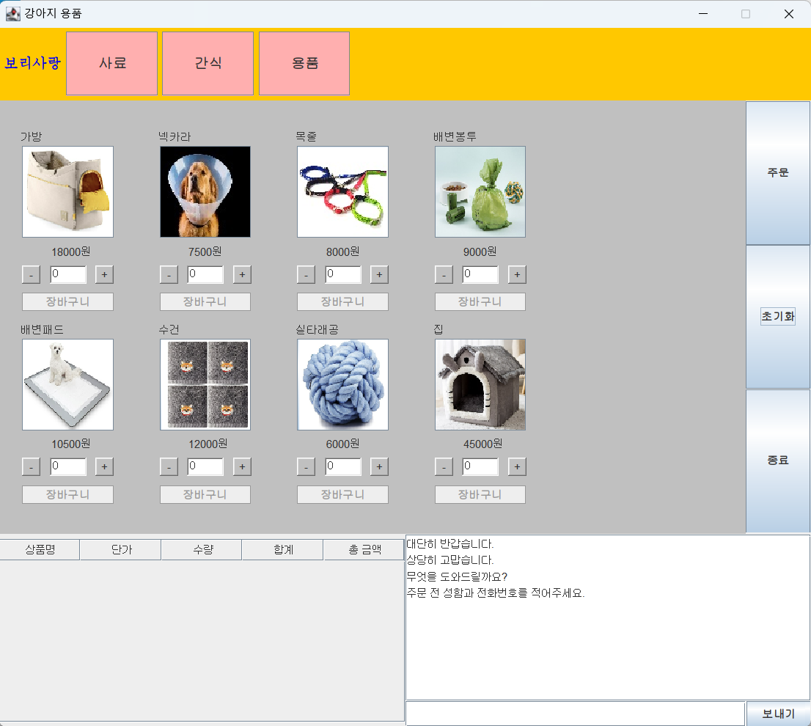
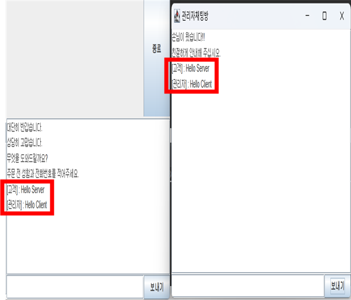
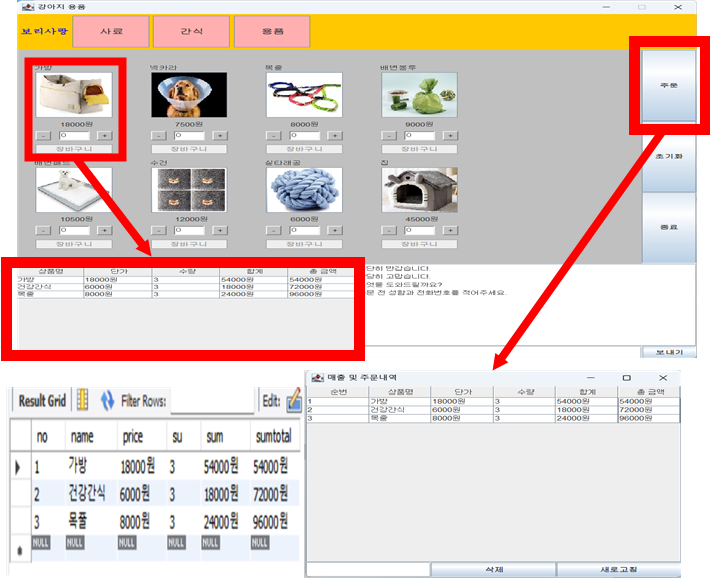
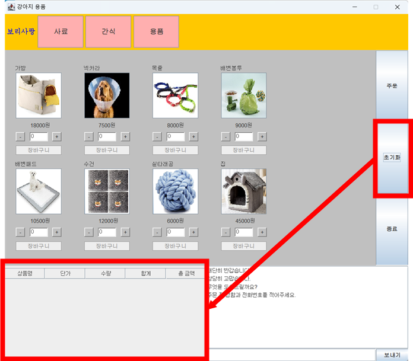
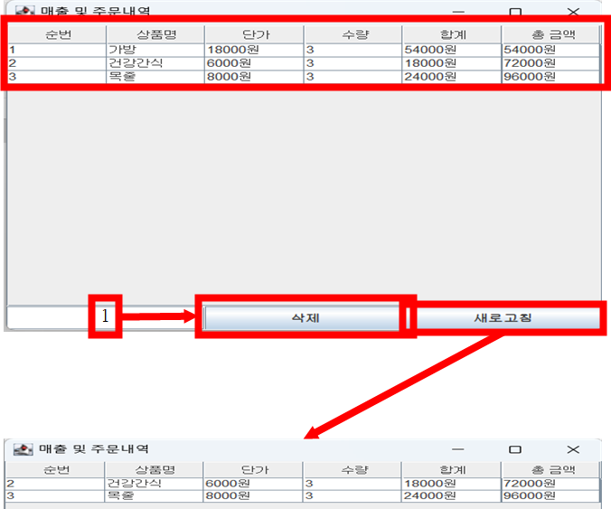

# 프로젝트명
 강아지 용품점 키오스크 

## 프로잭트 소개
 강아지의 용품들을 주문 내역에 추가하여 주문하는 프로그램

## 제작동기
 교과목 시간에 배운 내용을 최대한 활용하여 DB연동, GUI(Swing, JFrame), Thread와 서버구현 등을 사용하여 프로그램을 제작하였습니다.

## 연구방법
 * 브레인스토밍을 통한 아이디어 도출
 * 단점을 보완한 후 장점을 극대화 시키며 편리성을 추가
 * 알고리즘 제작 후 프로그래밍
 * 피드백을 통하여 수정
 * 프로그램 구동 후 테스트를 하며 오류를 수정

## 알고리즘

## 실행영상

## 화면 구성및 흐름
### 시작 화면

### 메인창

### Client와 Server 채팅창

### 주문하는 과정

### 재주문 및 주문내역 취소 과정
#### 클라이언트측에서의 재주문 과정

#### 서버측에서의 주문내역 수정

